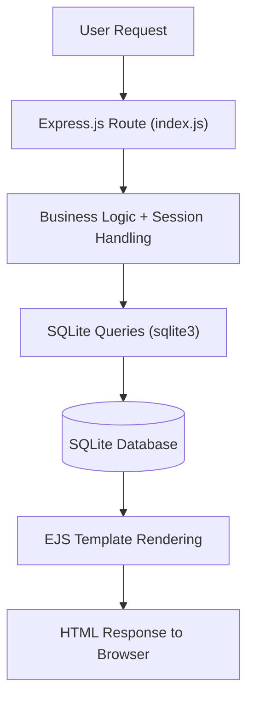

# ☕ CHINNAKORN Cafe


> 🎓 **2568 Academic Project** — A full-stack web application for managing and showcasing a café business online.

---

## 📖 Project Overview

**CHINNAKORN Cafe** is a full-stack web application with server-side rendering, developed as part of a **Web Programming Project (2568)**. It serves as an online platform for a café business, allowing customers to browse the menu, learn about the café, and place orders — while also providing staff-oriented pages for managing orders and inventory.

The project is built using **Node.js** with the **Express.js** framework on the backend, and **EJS (Embedded JavaScript)** as the templating engine for dynamic server-side rendered views, styled with custom **CSS**.

---

## ✨ Features

- 🏠 **Home Page** — Welcoming landing page with café branding and highlights  
- 📋 **Menu Browsing** — Browse categorized café items (drinks, food, desserts)  
- 🛒 **Order System** — Customers can add items to cart and place orders  
- 🧾 **Order & Inventory Management** — Staff can view and manage orders and product inventory  
- 📱 **Responsive Design** — Mobile-friendly UI across all screen sizes  
- 🗃️ **Database Integration** — Persistent data storage using SQLite  
- 🖼️ **Product Image Support** — Upload and display product images  

---

## 🗂 Project Structure

```
CHINNAKORN_cafe/
│
├── code_ing/                           # Main application source code
│ ├── public/                           # Static assets
│ │ ├── css/                            # Stylesheets
│ │ ├── images/                         # Product and UI images
│ │ └── js/                             # Client-side JavaScript
│ │ ├── ...
│ ├── views/                            # EJS templates (server-side rendered pages)
│ │ ├── main.ejs                        # Main / landing page
│ │ ├── selecting_menu.ejs              # Menu selection page
│ │ ├── selecting_menu_header.ejs       # Menu header component
│ │ ├── cart.ejs                        # Shopping cart
│ │ ├── confirm_order.ejs               # Order confirmation (staff)
│ │ ├── confirm_order-customer.ejs      # Order confirmation (customer)
│ │ ├── pay_qr.ejs                      # QR payment (staff)
│ │ ├── pay_qr-customer.ejs             # QR payment (customer)
│ │ ├── payment_success.ejs             # Payment success (staff)
│ │ ├── payment_success-customer.ejs    # Payment success (customer)
│ │ ├── inventory_for_barista.ejs       # Barista interface
│ │ ├── inventory_for_cashier.ejs       # Cashier interface
│ │ └── where_to_eat.ejs                # Dine-in selection
│ │
│ ├── Database/                         # SQLite database files
│ │ ├── *.db
│ │
│ ├── index.js                          # Main Express app (routes + logic)
│ ├── setup.js                          # Database setup script
│ └── package.json                      # Project dependencies
│
└── README.md                           # Project documentation
```

---

## ⚙️ Installation

### Prerequisites

Make sure you have the following installed on your machine:

| Tool | Version | Download |
|------|---------|----------|
| Node.js | v18+ | [nodejs.org](https://nodejs.org) |
| npm | v8+ | Bundled with Node.js |

---

### Step-by-Step Setup

1. **Clone the repository**
   ```bash
   git clone https://github.com/Varanapat/CHINNAKORN_cafe.git
   cd CHINNAKORN_cafe/code_ing

2. **Install dependencies**
   ```bash
   npm install
   ```

3. **Configure the database**
   - This project uses SQLite3, and the database is already included in the Database/ folder.
   - No additional setup is required.

4. **Run the application**
   ```bash
   node index.js
   ```

   Or with auto-reload during development:
   ```bash
   npx nodemon index.js
   ```

---

## 🚀 Usage

Once the server is running, open your browser and navigate to:

```
http://localhost:3000
```

### Available Routes

| Route | Method | Description |
|-------|--------|-------------|
| `/` | GET | Main / landing page |
| `/menu` | GET | Menu selection page |
| `/cart` | GET | View shopping cart |
| `/confirm-order` | GET/POST | Confirm customer order |
| `/payment` | GET | QR code payment page |
| `/payment-success` | GET | Display successful payment |
| `/inventory-barista` | GET | Barista interface for managing orders |
| `/inventory-cashier` | GET | Cashier interface for handling orders |
| `/where-to-eat` | GET | Select dine-in or takeaway option |

### Example: Starting the Server

```bash
# Production
node index.js

# Development (with hot reload)
npx nodemon index.js

# With npm script
npm run dev
```

---

## 📊 Workflow / Pipeline



---

**Flow Summary:**

1. 🌐 **Client** sends an HTTP request
2. 🚦 **Express Router** matches the URL to a route handler
3. 🧠 **Controller** processes business logic
4. 🗄️ **Model** executes SQL queries against SQLite
5. 🎨 **EJS View** renders the HTML with dynamic data
6. 📤 **Response** is sent back to the browser

---

## 🧠 Model / Method

This project follows a **simplified MVC (Model-View-Controller)** architectural pattern:

| Layer          | Role                              | Technology                      |
| -------------- | --------------------------------- | ------------------------------- |
| **Model**      | Data access & database queries    | SQLite (`sqlite3`)              |
| **View**       | UI rendering with dynamic data    | EJS templating engine           |
| **Controller** | Business logic & request handling | Node.js (within route handlers) |
| **Router**     | URL routing & middleware          | Express.js                      |

> Note: MVC layers are not fully separated. Routing, business logic, and database queries are handled together in `index.js`.

### Session Management

* Sessions are managed using **express-session**
* Shopping cart and order data are stored in session
* Used to maintain state for both customer and cashier workflows

> Note: This project does not implement a full authentication system (e.g., login, password hashing, or role-based access control).


### Database Design (Key Tables)

| Table             | Description                                          |
| ----------------- | ---------------------------------------------------- |
| `Menu`            | Café menu items with pricing and availability        |
| `Category`        | Menu categories (e.g., drinks, bakery)               |
| `Order`           | Customer orders with total price and status          |
| `OrderItem`       | Individual items within each order                   |
| `OrderItemOption` | Selected options for each order item                 |
| `OptionGroup`     | Groups of selectable options (e.g., size, sweetness) |
| `ItemOption`      | Specific options within each group                   |
| `Ingredient`      | Raw materials with stock tracking                    |
| `MenuIngredient`  | Mapping between menu items and required ingredients  |


---

## 📈 Evaluation / Results

### 🧾 System Overview

The system successfully implements a café ordering and management workflow, including:

* Menu browsing with dynamic options (e.g., size, add-ons)
* Session-based shopping cart for customers and cashier
* Order processing with automatic order ID generation
* QR code payment integration (PromptPay)
* Real-time stock deduction based on ingredients
* Inventory management interface for barista and cashier

---

### 💻 Technology Breakdown

| Language   | Percentage | Role                                         |
| ---------- | ---------- | -------------------------------------------- |
| JavaScript | 48.2%      | Server-side logic, routing, session handling |
| EJS        | 34.6%      | Dynamic UI rendering                         |
| CSS        | 16.8%      | Styling and layout                           |
| Other      | 0.4%       | Configuration and assets                     |


### Project Goals vs Outcomes

| Goal                                 | Status            |
| ------------------------------------ | ----------------- |
| Functional menu browsing             | ✅ Achieved        |
| Session-based cart system            | ✅ Achieved        |
| Order processing system              | ✅ Achieved        |
| QR code payment integration          | ✅ Achieved        |
| Inventory & stock management         | ✅ Achieved        |
| Order management (barista & cashier) | ✅ Achieved        |
| Responsive UI                        | ✅ Achieved        |
| Database persistence                 | ✅ Achieved        |
| User authentication system           | ❌ Not implemented |

---

## 🛠 Technologies Used

### Backend

| Library                                                          | Purpose                                  |
| ---------------------------------------------------------------- | ---------------------------------------- |
| [Node.js](https://nodejs.org/)                                   | JavaScript runtime environment           |
| [Express.js](https://expressjs.com/)                             | Web framework for routing and middleware |
| [sqlite3](https://www.npmjs.com/package/sqlite3)                 | SQLite database driver                   |
| [express-session](https://www.npmjs.com/package/express-session) | Session management                       |
| [qrcode](https://www.npmjs.com/package/qrcode)                   | Generate QR code for payment             |
| [promptpay-qr](https://www.npmjs.com/package/promptpay-qr)       | Generate PromptPay payment payload       |


### Frontend

| Technology | Purpose                              |
| ---------- | ------------------------------------ |
| EJS        | Server-side HTML templating          |
| CSS3       | Custom styling and responsive layout |
| Vanilla JS | Client-side interactivity            |

### Database

| Tool   | Purpose                                 |
| ------ | --------------------------------------- |
| SQLite | Relational database for persistent data |

### Dev Tools

| Tool    | Purpose                                |
| ------- | -------------------------------------- |
| nodemon | Auto-restart server during development |
| npm     | Package management                     |


---

## 📄 Example Output

### 🏠 Entry Page

The system starts with a **dine-in or takeaway selection page**, allowing users to choose how they want to order before accessing the menu.

---

### 📋 Menu Page

```
┌──────────────────────────────────────┐
│         ☕ Our Menu                  │
│  ─────────────────────────────────  │
│  [Drinks] [Bakery]                  │
│                                      │
│  🧋 Thai Milk Tea      ฿ 60         │
│  ☕ Americano          ฿ 55         │
│  🥐 Croissant         ฿ 45          │
│                                      │
│  [Add to Cart]  [Customize Options] │
└──────────────────────────────────────┘
```

---

### 🛒 Cart & Order Flow

```
Select Items → Customize Options → Add to Cart → 
Review Order → Confirm → Payment (QR) → Success ✅
```

---

### ☕ Staff Interface (Barista / Cashier)

```
┌──────────────────────────────────────┐
│  Order Management Panel             │
│  ─────────────────────────────────  │
│  🧾 Pending Orders                  │
│  • Order #20260405-001             │
│    - 2x Americano                  │
│    - 1x Thai Milk Tea (Less Sugar) │
│                                      │
│  [Mark as Complete]                │
└──────────────────────────────────────┘
```

---

## 👤 Author

| Field | Info |
|-------|------|
| 👤 **Author** | [@Varanapat](https://github.com/Varanapat) & [@pngkcwtk](https://github.com/pngkcwtk)  |
| 🎓 **Project** | Web Programming Project 2568 |
| 📁 **Repository** | [CHINNAKORN_cafe](https://github.com/Varanapat/CHINNAKORN_cafe) |

---

<div align="center">

Made with ☕ & ❤️ for the **CHINNAKORN Cafe** Web Project 2568

</div>
