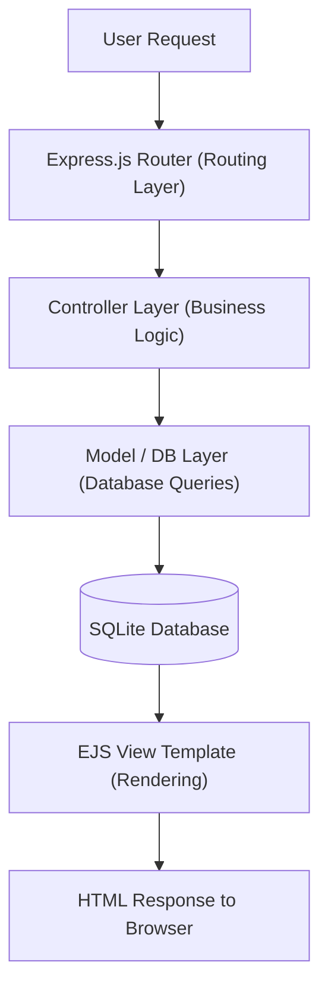

# ☕ CHINNAKORN Cafe


> 🎓 **2568 Academic Project** — A full-stack web application for managing and showcasing a café business online.

---

## 📖 Project Overview

**CHINNAKORN Cafe** is a full-stack web application built as part of a **Web Programming Project (2568)**. It serves as an online platform for a café business, allowing customers to browse the menu, learn about the café, and place orders — while giving administrators tools to manage products and orders efficiently.

The project is developed using **Node.js** with the **Express.js** framework on the backend and **EJS** (Embedded JavaScript) as the templating engine for server-side rendered views, styled with custom **CSS**.

---

## ✨ Features

- 🏠 **Home Page** — Welcoming landing page with café branding and highlights
- 📋 **Menu Browsing** — Browse categorized café items (drinks, food, desserts)
- 🛒 **Order System** — Customers can add items to cart and place orders
- 🔐 **User Authentication** — Register and login system for customers and admins
- 🛠️ **Admin Dashboard** — Manage menu items, view and process customer orders
- 📱 **Responsive Design** — Mobile-friendly UI across all screen sizes
- 🗃️ **Database Integration** — Persistent data storage with MySQL
- 🖼️ **Product Image Support** — Upload and display product images

---

## 🗂 Project Structure

```
CHINNAKORN_cafe/
│
├── code_ing/                   # Main application source code
│   ├── public/                 # Static assets
│   │   ├── css/                # Stylesheets
│   │   ├── images/             # Product and UI images
│   │   └── js/                 # Client-side JavaScript
│   │
│   ├── views/                  # EJS templates (server-side rendered pages)
│   │   ├── partials/           # Reusable components (header, footer, navbar)
│   │   ├── index.ejs           # Home page
│   │   ├── menu.ejs            # Menu listing page
│   │   ├── cart.ejs            # Shopping cart page
│   │   ├── login.ejs           # Login page
│   │   ├── register.ejs        # Registration page
│   │   └── admin/              # Admin panel views
│   │
│   ├── routes/                 # Express route handlers
│   │   ├── index.js            # Public routes
│   │   ├── auth.js             # Authentication routes
│   │   ├── menu.js             # Menu routes
│   │   └── admin.js            # Admin routes
│   │
│   ├── controllers/            # Business logic controllers
│   ├── models/                 # Database models / query logic
│   ├── config/                 # Database & app configuration
│   │   └── db.js               # MySQL connection setup
│   │
│   ├── app.js                  # Express application entry point
│   └── package.json            # Project dependencies and scripts
│
└── README.md                   # Project documentation
```

---

## ⚙️ Installation

### Prerequisites

Make sure you have the following installed on your machine:

| Tool | Version | Download |
|------|---------|----------|
| Node.js | v18+ | [nodejs.org](https://nodejs.org) |
| npm | v8+ | Bundled with Node.js |
| MySQL | v8+ | [mysql.com](https://www.mysql.com) |

### Step-by-Step Setup

1. **Clone the repository**
   ```bash
   git clone https://github.com/Varanapat/CHINNAKORN_cafe.git
   cd CHINNAKORN_cafe/code_ing
   ```

2. **Install dependencies**
   ```bash
   npm install
   ```

3. **Configure the database**
   - Create a MySQL database:
     ```sql
     CREATE DATABASE chinnakorn_cafe;
     ```
   - Import the SQL schema (if provided):
     ```bash
     mysql -u root -p chinnakorn_cafe < database/schema.sql
     ```

4. **Set up environment variables**

   Create a `.env` file in the `code_ing/` directory:
   ```env
   DB_HOST=localhost
   DB_USER=root
   DB_PASSWORD=your_password
   DB_NAME=chinnakorn_cafe
   SESSION_SECRET=your_secret_key
   PORT=3000
   ```

5. **Start the application**
   ```bash
   npm start
   ```

   Or with auto-reload during development:
   ```bash
   npx nodemon app.js
   ```

---

## 🚀 Usage

Once the server is running, open your browser and navigate to:

```
http://localhost:3000
```

### Available Routes

| Route | Method | Description |
|-------|--------|-------------|
| `/` | GET | Home / landing page |
| `/menu` | GET | Browse menu items |
| `/cart` | GET | View shopping cart |
| `/order` | POST | Place an order |
| `/register` | GET/POST | User registration |
| `/login` | GET/POST | User login |
| `/logout` | GET | Logout |
| `/admin` | GET | Admin dashboard (protected) |
| `/admin/products` | GET/POST | Manage menu items |
| `/admin/orders` | GET | View all orders |

### Example: Starting the Server

```bash
# Production
node app.js

# Development (with hot reload)
npx nodemon app.js

# With npm script
npm run dev
```

---

## 📊 Workflow / Pipeline



**Flow Summary:**

1. 🌐 **Client** sends an HTTP request
2. 🚦 **Express Router** matches the URL to a route handler
3. 🧠 **Controller** processes business logic
4. 🗄️ **Model** executes SQL queries against MySQL
5. 🎨 **EJS View** renders the HTML with dynamic data
6. 📤 **Response** is sent back to the browser

---

## 🧠 Model / Method

This project follows the **MVC (Model-View-Controller)** architectural pattern:

| Layer | Role | Technology |
|-------|------|------------|
| **Model** | Data access & database queries | MySQL + custom query functions |
| **View** | UI rendering with dynamic data | EJS templating engine |
| **Controller** | Business logic & request handling | Node.js functions |
| **Router** | URL routing & middleware | Express.js |

### Authentication Flow

- Passwords are hashed using **bcrypt** before storage
- Sessions are managed with **express-session**
- Protected routes use middleware to verify authentication status
- Admin routes have role-based access control

### Database Design (Key Tables)

| Table | Description |
|-------|-------------|
| `users` | Customer and admin accounts |
| `products` | Café menu items with prices and categories |
| `orders` | Customer orders with status tracking |
| `order_items` | Individual items within each order |
| `categories` | Product categories (drinks, food, desserts) |

---

## 📈 Evaluation / Results

### Language Breakdown

| Language | Percentage | Role |
|----------|-----------|------|
| JavaScript | 48.2% | Server-side logic, routing, controllers |
| EJS | 34.6% | HTML templating and dynamic views |
| CSS | 16.8% | Styling and responsive design |
| Other | 0.4% | Config files, assets |

### Project Goals vs Outcomes

| Goal | Status |
|------|--------|
| Functional menu browsing | ✅ Achieved |
| User registration & login | ✅ Achieved |
| Shopping cart system | ✅ Achieved |
| Admin product management | ✅ Achieved |
| Order management | ✅ Achieved |
| Responsive UI | ✅ Achieved |
| Database persistence | ✅ Achieved |

---

## 🛠 Technologies Used

### Backend

| Library | Purpose |
|---------|---------|
| [Node.js](https://nodejs.org/) | JavaScript runtime environment |
| [Express.js](https://expressjs.com/) | Web framework for routing and middleware |
| [mysql2](https://www.npmjs.com/package/mysql2) | MySQL database driver |
| [express-session](https://www.npmjs.com/package/express-session) | Session management |
| [bcrypt](https://www.npmjs.com/package/bcrypt) | Password hashing |
| [multer](https://www.npmjs.com/package/multer) | File/image upload handling |
| [dotenv](https://www.npmjs.com/package/dotenv) | Environment variable management |

### Frontend

| Technology | Purpose |
|-----------|---------|
| EJS | Server-side HTML templating |
| CSS3 | Custom styling and responsive layout |
| Vanilla JS | Client-side interactivity |

### Database

| Tool | Purpose |
|------|---------|
| MySQL | Relational database for all persistent data |

### Dev Tools

| Tool | Purpose |
|------|---------|
| nodemon | Auto-restart server during development |
| npm | Package management |

---

## 📄 Example Output

### 🏠 Home Page
The landing page greets visitors with the CHINNAKORN Cafe branding, featured menu highlights, and a call-to-action to explore the menu.

### 📋 Menu Page
```
┌──────────────────────────────────────┐
│         ☕ Our Menu                  │
│  ─────────────────────────────────  │
│  [Drinks] [Food] [Desserts]          │
│                                      │
│  🧋 Thai Milk Tea      ฿ 60         │
│  ☕ Americano          ฿ 55         │
│  🍰 Basque Cheesecake  ฿ 120        │
│                                      │
│  [Add to Cart]  [View Details]       │
└──────────────────────────────────────┘
```

### 🛒 Cart & Order Flow
```
Select Items → Add to Cart → Review Order → Confirm → Order Placed ✅
```

### 🛠️ Admin Dashboard
```
┌──────────────────────────────────────┐
│  Admin Panel - CHINNAKORN Cafe       │
│  ─────────────────────────────────  │
│  📦 Products: 24 items               │
│  🧾 Pending Orders: 5                │
│  ✅ Completed Today: 18              │
│                                      │
│  [Manage Products] [View Orders]     │
└──────────────────────────────────────┘
```

---

## 👤 Author

| Field | Info |
|-------|------|
| 👤 **Author** | [@Varanapat](https://github.com/Varanapat) & [@pngkcwtk](https://github.com/pngkcwtk)  |
| 🎓 **Project** | Web Programming Project 2568 |
| 📁 **Repository** | [CHINNAKORN_cafe](https://github.com/Varanapat/CHINNAKORN_cafe) |

---

<div align="center">

Made with ☕ & ❤️ for the **CHINNAKORN Cafe** Web Project 2568

</div>
